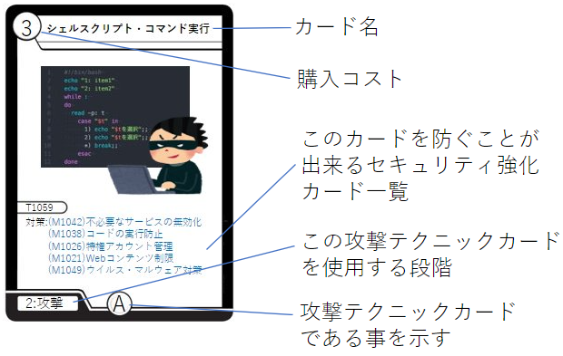
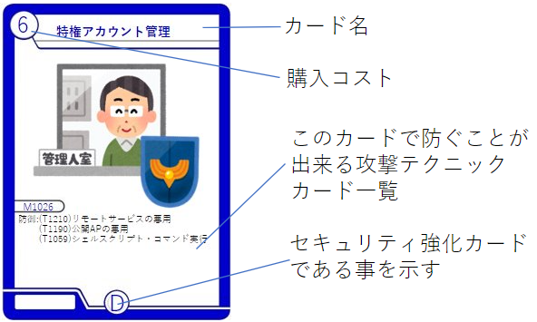
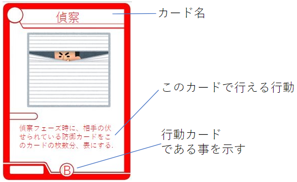
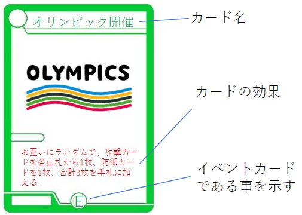
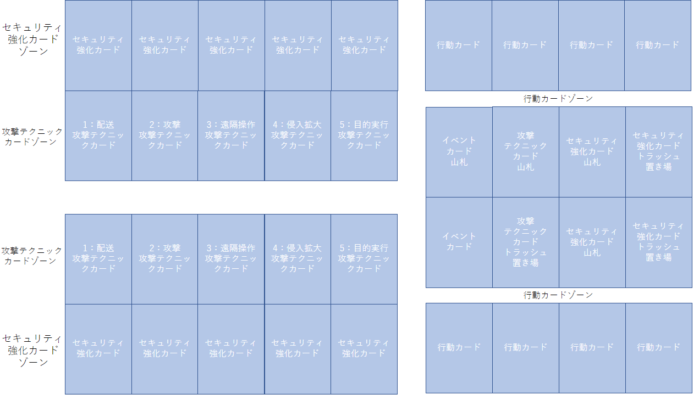

# Cyber FrontLine

- プレイ人数
    - 2人
- プレイ時間
    - 30 min~

- 内容物
    - 攻撃テクニックカード16種類64枚(各4枚)
    - 防御(セキュリティ強化)カード16種類32枚(各2枚)
    - 行動カード4種類20枚(偵察6枚、武器化6枚、セキュリティ強化実施6枚、攻撃実施2枚)
    - イベントカード12種類
    - 資金(電卓等で管理してください)

あなたは国家機関のサイバー諜報員となりました。
攻撃テクニックを組み合わせて敵対組織のセキュリティを突破し、攻撃目標を達成しましょう。
相手も攻撃を仕掛けてきます。セキュリティ強化を行い、攻撃を防ぎましょう。

## ゲームの概要

- プレイヤーは相手プレイヤーのセキュリティ強化をかいくぐってサイバー攻撃を行います。
- 攻撃は5つの段階(配送、攻撃、遠隔操作、侵入拡大、目的実行)に分かれ、5段階目まで順に攻撃を成功させてください。
- 相手プレイヤーからの攻撃に対してはセキュリティ強化カードを使用することで、攻撃を防ぐことができます。

## ゲームの決着

- セットを2本勝利したプレイヤーの勝利となります。

### セットの決着

- 5つの段階の攻撃(配送、攻撃、遠隔操作、侵入拡大、目的実行)を順に行い、5段階目まで成功させると勝利となります。
- 次のセットでは手札、盤面、資金をリセットし、もう一度ゲームを行います。

## カード

- 攻撃テクニックカードの見方
    - 

- セキュリティ強化カードの見方
    - 

- 行動カードの見方
    - 

- イベントカードの見方
    - 

## フィールドのイメージ

- 攻撃テクニックカードゾーン

    - 5種類の攻撃テクニックカードを1枚ずつ順番に、合計5枚まで表向きで配置することができます。

    - 「配送」「攻撃」「遠隔操作」「侵入拡大」「目的実行」の順に並べる必要があり、種類を飛ばして次の種類のカードを置くことはできません。

    - 「配送」「攻撃」「遠隔操作」「侵入拡大」「目的実行」の攻撃テクニックカードを1枚ずつ、合計5枚を攻撃テクニックカードゾーンに配置することでセットの勝利となります。

- セキュリティ強化カードゾーン

    - セキュリティ強化カードを最大5枚まで配置することができます。

    - 自身のセキュリティ強化カードが表向きになっている場合、セキュリティ強化カードで指定された攻撃カードを相手プレイヤーが配置した場合、その攻撃カードを捨てます。

- 行動カードゾーン
    - 毎ターンの行動決定フェーズで、行動カードを3枚まで置いて、そのターンの行動を決定することができます。
    - 一部のイベントカードの効果により、4枚まで置けるようになります。

- トラッシュ
    - お互いのプレイヤーが捨てた札を置きます。

## ゲームの準備

1. 先攻・後攻の決定
コイントス等で決定します。

1. 攻撃テクニックカードの山札の用意
    - すべての攻撃テクニックカードを裏側の状態でシャッフルし、1つの山として用意します。
    - 攻撃テクニックカードの山札を引ききった場合は、攻撃テクニックカードの捨て札を裏側にしてシャッフルし、攻撃テクニックカードの山札とします。

1. セキュリティ強化カードの山札の用意
    - セキュリティ強化カード16種類16枚を1つの山として2つの山を用意し、各プレイヤーに1山ずつ配ります。

1. イベントカード山札の用意
    - すべてのイベントカードを裏側の状態でシャッフルし、1つの山として用意します。
    - イベントカードの山札を引ききった場合は、イベントカードの捨て札を裏側にしてシャッフルし、イベントカードの山札とします。

1. 行動カードの配布
    - 各プレイヤーに行動カード(偵察3枚、武器化3枚、セキュリティ強化実施3枚、攻撃実施1枚ずつ)を配布します。

1. セキュリティ強化カードの購入
    - 配られたセキュリティ強化カードの山札から、「ウイルス・マルウェア対策​」を1枚手札に加えます。この時コストを支払う必要はありません。
    - 各プレイヤーに資金を20配ります。
    - 各プレイヤーは配布されているセキュリティ強化カードの山から、4枚までを選択して購入し、手札に加えます。購入時はカード左上で指定されたコストを資金から支払う必要があります。
    - 手札のカードは自分のセキュリティ強化カードエリアにセットします。(最大5枚まで伏せることができます。)
    - 残った資金はそのまま持った状態でゲームを開始します。

## ゲームの流れ
- 1ターンごとに、以下のフェーズを順に行います。
- 各フェーズ内では先攻プレイヤーの処理を行った後に後攻プレイヤーの処理を行います。(開始フェーズ→先攻の行動決定フェーズ→後攻の行動決定フェーズ→先攻の偵察フェーズ→後攻の偵察フェーズ･････)

1. 開始フェーズ
    - このフェーズは先攻・後攻関係なく1回のみ行います。
    - イベントカード山札からイベントカード1枚を引いて表にし、お互いにその効果を処理します。1ターン目は実施しません。
    - 各プレイヤーの資金が10増加します。

1. 行動決定フェーズ
    - 各プレイヤーは配布されている10枚の行動決定カードから3枚まで選んで提示し、このターンの行動とします。
    - 一部のイベントカードの効果により4枚まで提示できる場合があります。

1. 偵察フェーズ
    - 行動決定フェーズで偵察カードを1枚以上選んでいるプレイヤーのみ実施できます。
    - 行動決定フェーズで選んだ「偵察」行動カードの枚数まで、相手が裏側で伏せている防御カードを表にすることができます。

1. 武器化フェーズ
    - 行動決定フェーズで武器化カードを1枚以上選んでいるプレイヤーのみ実施できます。
    - 攻撃テクニックカードの山札から5枚を確認(相手に見せる必要はありません)して1枚選んで購入し、手札に加えることができます。購入しなかった4枚のカードは山札に戻してシャッフルします。購入時はカード左上で指定されたコストを資金から支払う必要があります。
    - 行動決定フェーズで選んだ「武器化」行動カードの枚数まで、購入することができます。

1. 攻撃実施フェーズ
    - 行動決定フェーズで攻撃実施カードを選んでいるプレイヤーのみ実施できます。
    - 攻撃実施をするプレイヤーは、手札の攻撃テクニックカードを攻撃テクニックカードゾーンに配置していきます。
    - 必ず「配送」「攻撃」「遠隔操作」「侵入拡大」「目的実行」の順に1枚ずつ配置します。1回の攻撃実施フェーズに合計5枚まで配置することができます。
    - 攻撃テクニックカードが1枚配置される度に、相手プレイヤーは自身が伏せたセキュリティ強化カード1枚以上を表にすることができます。
    - その後、表になっている相手のセキュリティ強化カードを確認し、配置した攻撃テクニックカード名が記載されているかどうか判定します。記載されていた場合、以下の①②から選択して実施します。
        1. 配置したカード1枚と同名の攻撃テクニックカード1枚を手札から捨てることで、そのセキュリティ強化カードの効果をこのターンの間無効化します。ただし、複数のセキュリティ強化カードに、配置した攻撃テクニックカードの名前が記載されている場合は、記載のあるセキュリティ強化カードの枚数だけ同名の攻撃テクニックカードを手札から捨てます。
        2. その攻撃テクニックカード1枚を捨て札エリアに置きます。先攻の攻撃実施フェーズであった場合は、後攻の攻撃実施フェーズに移ります。後攻の攻撃実施フェーズの場合はセキュリティ強化フェーズに移ります。

1. セキュリティ強化フェーズ
    - 行動決定フェーズでセキュリティ強化実施カードを1枚以上選んでいるプレイヤーのみ実施できます。
    - 自分に配られたセキュリティ強化カードの山札を確認し、1枚選んで購入することができます。
    購入時はカード左上で指定されたコストを資金から支払う必要があります。
    - 行動決定フェーズで選んだ「セキュリティ強化」行動カードの枚数まで、購入することができます。
    - 手札のセキュリティ強化カードは任意の枚数だけセキュリティ強化カードゾーンに伏せることができます。

1. セキュリティ強化フェーズが終了したら次のターンを開始フェーズから再び行います。

### 2セット目

- 1セット目で負けたプレイヤーは2セット目の開始前に配布される資金が30になります。
- 1セット目で負けたプレイヤーは先攻・後攻を選択することができます。

### 3セット目

- 1, 2セット目の両方を勝利したプレイヤーはゲームに勝利します。3セット目は行いません。
- 1, 2セット目を異なるプレイヤーが勝利した場合は以下の条件で3セット目を開始します。
    - お互いのプレイヤーは3セット目の開始前に配布される資金が30になります。
    - 2セット目で負けたプレイヤーは先攻・後攻を選択することができます。
    - 3セット目を勝利したプレイヤーがゲームに勝利します。

---

## おわりに

- 本ゲームはMITRE ATT&CKの情報を利用して開発しました。
    - © 2021 The MITRE Corporation. This work is reproduced and distributed with the permission of The MITRE Corporation.​
    - https://attack.mitre.org/resources/terms-of-use/​
